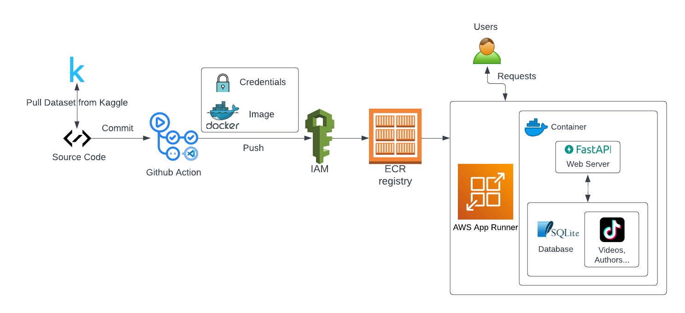

[](https://github.com/nogibjj/DE_Microservice/actions/workflows/cicd.yml)
# DE_Microservice
This is the repo for the 706 final project.

Members: Boyi Wang (bw224), Qiheng Gao (qg45), Yutong Zhang (yz566), Zilin Yin (zy108)

### Project Description
The goal of this project is to provides a easy way for people who want to get more information or perform queries for their data-related work on "Popular TikTok Videos, Authors, and Musics" dataset (ref: https://www.kaggle.com/datasets/thedevastator/popular-tiktok-videos-authors-and-musics?resource=download). Our server provides 3 APIs. The getAuthor and getTrendingVideo APIs allow people to quickly identify videos or authors of most popularity in Tiktok community based on multiple criteria, including number of likes, number of shares, number of comments and number of plays. And with filterVideo API, people could also quickly get videos that most likely contain the content that they want to see/view.

### Flow Diagram


### "tiktok_video" Table Description:

| Column name | Description                                                          |
|-------------|----------------------------------------------------------------------|
| user_name   | The name of the user who posted the video. (String)                  |
| user_id     | The id of the user who posted the video. (Integer)                   |
| video_id    | The id of the posted video. (Integer)                                |
| video_desc  | The description of the posted video. (String)                        |
| video_time  | The posted time of the video. (Integer)                              |
| video_length| The length of the posted video. (Integer)                            |
| video_link  | The link of the posted video. (String)                               |
| n_likes     | The number of likes the video has received. (Integer)                |
| n_shares    | The number of shares the video has received. (Integer)               |
| n_comments  | The number of comments the video has received. (Integer)             |
| n_plays     | The number of times the video has been played. (Integer) expand_less |

### Sample SQL Queries:

1.. Identifying popular TikTok authors to target for scraping videos and liked videos:

```
SELECT user_id, user_name FROM tiktok_video WHERE n_likes > <n_likes> OR n_shares > <n_shares> OR n_comments > <n_comments> OR n_plays > <n_plays>;
```

2.. Finding trending videos on TikTok for further analysis:

```
SELECT video_id, video_desc, video_time, video_length, video_link FROM tiktok_video WHERE n_likes > <n_likes> OR n_shares > <n_shares> OR n_comments > <n_comments> OR n_plays > <n_plays>;
```

3.. Generating a list of videos from the TikTok app that are tagged with the #funny hashtag:

```
SELECT video_id, video_link FROM tiktok_video WHERE video_desc LIKE '#funny';
```

### Sample API Usage:

API: GET /query/getAuthor<br>
Description: Get the first 5 authors with either 50000+ likes or 50000+ shares or 50000+ comments or 50000+ plays
- Request:
```
curl -X 'GET' \
  'https://phd2mukuyv.us-east-1.awsapprunner.com/query/getAuthor' \
  -H 'accept: application/json' \
  -H 'Content-Type: application/json' \
  -d '{
  "likes": 50000,
  "shares": 50000,
  "comments": 50000,
  "plays": 50000
}'
```
- Response:
```
{"sql":"SELECT user_id, user_name FROM tiktok_video WHERE n_likes >50000 OR n_shares >50000 OR n_comments >50000 OR n_plays > 50000 LIMIT 5","result":"(6737188750352401410, 'bts_official_bighit'),(6527426242138870784, 'dulssy'),(6974782710108521477, 'coco224466'),(6807620910251115525, 'moontellthat'),(6770811947673404422, 'spicekingcam'),"}
```

API: GET /query/getTrendingVideo<br>
Description: Get the first 5 videos with either 10000+ likes or 20000+ shares or 30000+ comments or 40000+ plays
- Request:
```
curl -X 'GET' \
  'https://phd2mukuyv.us-east-1.awsapprunner.com/query/getTrendingVideo' \
  -H 'accept: application/json' \
  -H 'Content-Type: application/json' \
  -d '{
  "likes": 10000,
  "shares": 20000,
  "comments": 30000,
  "plays": 40000
}'
```
- Response:
```
{"sql":"SELECT video_id, video_desc, video_time, video_length, video_link        FROM tiktok_video WHERE n_likes >10000 OR n_shares >20000 OR n_comments >30000 OR n_plays > 40000 LIMIT 5","result":"(6999919482068077826, '✌️💜😚\\xa0#쮀이호오오옵\\xa0과\\xa0함께\\xa0신나게\\xa0#PTD', 1629795759, 18, 'https://www.tiktok.com/@bts_official_bighit/video/6999919482068077826?lang=en'),(6989072033573391621, '😂😂😂😂', 1627270146, 9, 'https://www.tiktok.com/@dulssy/video/6989072033573391621?lang=en'),(6977625126338710789, 'He really did the 🦗🦟#happydog #puppy #dog #funnyvideo #animals #foryou #foryoupage #fypシ #dogsoftiktok #viral #fypage', 1624604959, 10, 'https://www.tiktok.com/@coco224466/video/6977625126338710789?lang=en'),(6978279631048772869, 'I do need help 😩 #trolling  #vietnamesegirl #couplecomedy #womenpower', 1624757343, 27, 'https://www.tiktok.com/@moontellthat/video/6978279631048772869?lang=en'),(6967513355456187654, 'shhh asmr #spiceking', 1622250623, 15, 'https://www.tiktok.com/@spicekingcam/video/6967513355456187654?lang=en'),"}
```

API: GET /query/filterVideo<br>
Description: Get the first 5 videos with containing specified keyword in their descriptions
- Request:
```
curl -X 'GET' \
  'https://phd2mukuyv.us-east-1.awsapprunner.com/query/filterVideo' \
  -H 'accept: application/json' \
  -H 'Content-Type: application/json' \
  -d '{
  "desc": "funny" 
}'
```
- Response:
```
{"sql":"SELECT video_id, video_link FROM tiktok_video WHERE video_desc LIKE '%funny%' LIMIT 5","result":"(6977625126338710789, 'https://www.tiktok.com/@coco224466/video/6977625126338710789?lang=en'),(6982411189116603653, 'https://www.tiktok.com/@andypa123/video/6982411189116603653?lang=en'),(6995542759981452549, 'https://www.tiktok.com/@mercuri_88/video/6995542759981452549?lang=en'),(6996149714248912134, 'https://www.tiktok.com/@idaamayy/video/6996149714248912134?lang=en'),(6992214350723419398, 'https://www.tiktok.com/@coco_world7/video/6992214350723419398?lang=en'),"}
```